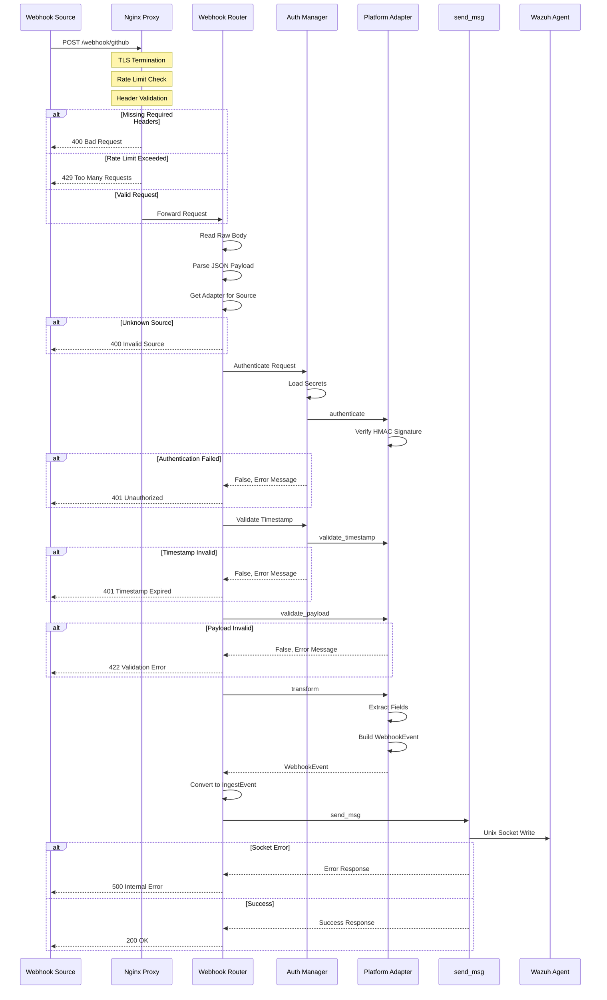

# Webhook Adapter Layer Architecture

## Document Information
- **Version**: 1.0.0
- **Date**: 2025-01-30
- **Status**: Design Complete
- **Author**: Architecture Team

---

## Table of Contents
1. [Executive Summary](#1-executive-summary)
2. [High-Level Architecture](#2-high-level-architecture)
3. [Component Specifications](#3-component-specifications)
4. [Data Flow](#4-data-flow)
5. [Configuration Schema](#5-configuration-schema)
6. [File Structure](#6-file-structure)
7. [API Contract](#7-api-contract)
8. [Integration Specifications](#8-integration-specifications)
9. [Security Implementation](#9-security-implementation)
10. [Decision Log](#10-decision-log)

---

## 1. Executive Summary

### 1.1 Purpose
This document describes the architecture for a webhook adapter layer that transforms the existing Wazuh log ingestion pipeline into a universal webhook endpoint. The design enables receiving webhooks from multiple platforms (GitHub, GitLab, Slack, PagerDuty, Sentry, Jira, AWS SNS, Datadog) and normalizing them for Wazuh SIEM ingestion.

### 1.2 Design Principles
- **Backward Compatibility**: Existing `/ingest` and `/batch` endpoints remain unchanged
- **Security First**: All security controls from security analysis implemented
- **Extensibility**: Easy to add new webhook sources without modifying core code
- **Simplicity**: No overengineering - prioritize reliability over features
- **Testability**: Components independently testable

### 1.3 Key Architectural Decisions
| Decision | Choice | Rationale |
|----------|--------|-----------|
| Endpoint Design | Source-specific (`/webhook/{source}`) | Security, rate limiting, clarity |
| Adapter Pattern | Class-based with ABC | Contract enforcement, testability |
| Authentication | Layered (Nginx + Application) | Defense in depth |
| Configuration | Hybrid (YAML + Docker secrets) | Security, flexibility |
| Integration | FastAPI APIRouter module | Modularity, minimal changes |
| Transformation | Hybrid (normalized + raw) | Consistency + completeness |

---

## 2. High-Level Architecture

### 2.1 Architecture Diagram

```
┌─────────────────────────────────────────────────────────────────────────────┐
│                              EXTERNAL NETWORK                                │
│  ┌─────────┐ ┌─────────┐ ┌─────────┐ ┌─────────┐ ┌─────────┐ ┌─────────┐   │
│  │ GitHub  │ │ GitLab  │ │  Slack  │ │PagerDuty│ │ Sentry  │ │  Jira   │   │
│  └────┬────┘ └────┬────┘ └────┬────┘ └────┬────┘ └────┬────┘ └────┬────┘   │
│       │           │           │           │           │           │         │
│       └───────────┴───────────┴─────┬─────┴───────────┴───────────┘         │
│                                     │                                        │
│                                     ▼                                        │
│  ┌──────────────────────────────────────────────────────────────────────┐   │
│  │                         NGINX REVERSE PROXY                           │   │
│  │  ┌────────────────┐  ┌────────────────┐  ┌────────────────────────┐  │   │
│  │  │  TLS Termination│  │  Rate Limiting │  │  Header Validation     │  │   │
│  │  │  (HTTPS)        │  │  (per-source)  │  │  (required headers)    │  │   │
│  │  └────────────────┘  └────────────────┘  └────────────────────────┘  │   │
│  └──────────────────────────────────────────────────────────────────────┘   │
└─────────────────────────────────────────────────────────────────────────────┘
                                      │
                                      ▼
┌─────────────────────────────────────────────────────────────────────────────┐
│                              INTERNAL NETWORK                                │
│  ┌──────────────────────────────────────────────────────────────────────┐   │
│  │                      WAZUH API SERVICE (FastAPI)                      │   │
│  │                                                                        │   │
│  │  ┌─────────────────────────────────────────────────────────────────┐  │   │
│  │  │                    EXISTING ENDPOINTS                            │  │   │
│  │  │  POST /ingest ──────► IngestEvent ──────► send_msg() ──────►    │  │   │
│  │  │  POST /batch  ──────► BatchIngest ──────► send_msg() ──────►    │  │   │
│  │  │  GET  /health/*                                                  │  │   │
│  │  └─────────────────────────────────────────────────────────────────┘  │   │
│  │                                                                        │   │
│  │  ┌─────────────────────────────────────────────────────────────────┐  │   │
│  │  │                    WEBHOOK ADAPTER LAYER (NEW)                   │  │   │
│  │  │                                                                   │  │   │
│  │  │  POST /webhook/{source}                                          │  │   │
│  │  │         │                                                         │  │   │
│  │  │         ▼                                                         │  │   │
│  │  │  ┌─────────────┐    ┌─────────────┐    ┌─────────────────────┐  │  │   │
│  │  │  │   Webhook   │───►│    Auth     │───►│  Platform Adapter   │  │  │   │
│  │  │  │   Router    │    │   Manager   │    │  (GitHub/Slack/...) │  │  │   │
│  │  │  └─────────────┘    └─────────────┘    └──────────┬──────────┘  │  │   │
│  │  │                                                    │             │  │   │
│  │  │                                                    ▼             │  │   │
│  │  │                                        ┌─────────────────────┐  │  │   │
│  │  │                                        │  Payload Normalizer │  │  │   │
│  │  │                                        │  (→ IngestEvent)    │  │  │   │
│  │  │                                        └──────────┬──────────┘  │  │   │
│  │  │                                                    │             │  │   │
│  │  └────────────────────────────────────────────────────┼─────────────┘  │   │
│  │                                                       │                │   │
│  │                                                       ▼                │   │
│  │                                              ┌─────────────────┐       │   │
│  │                                              │    send_msg()   │       │   │
│  │                                              │  (Unix Socket)  │       │   │
│  │                                              └────────┬────────┘       │   │
│  └───────────────────────────────────────────────────────┼────────────────┘   │
│                                                          │                    │
│                                                          ▼                    │
│  ┌──────────────────────────────────────────────────────────────────────┐   │
│  │                         WAZUH AGENT                                   │   │
│  │                    /var/ossec/queue/sockets/queue                     │   │
│  └──────────────────────────────────────────────────────────────────────┘   │
└─────────────────────────────────────────────────────────────────────────────┘
                                      │
                                      ▼
                         ┌────────────────────────┐
                         │     WAZUH MANAGER      │
                         │   (External Service)   │
                         └────────────────────────┘
```

### 2.2 Component Overview

| Component | Responsibility | Location |
|-----------|---------------|----------|
| Nginx Reverse Proxy | TLS, rate limiting, header validation | `deploy/nginx/` |
| Webhook Router | Route requests to appropriate adapter | `api/webhooks/router.py` |
| Auth Manager | Signature verification, timestamp validation | `api/webhooks/auth.py` |
| Platform Adapters | Platform-specific authentication and transformation | `api/webhooks/adapters/` |
| Payload Normalizer | Transform to IngestEvent format | Within each adapter |
| Config Manager | Load and manage webhook configuration | `api/webhooks/config.py` |

---

## 3. Component Specifications

### 3.1 Webhook Router

**File**: [`api/webhooks/router.py`](api/webhooks/router.py)

**Responsibility**: 
- Define FastAPI router with webhook endpoints
- Route requests to appropriate platform adapter
- Handle common error responses

**Interface**:
```python
from fastapi import APIRouter, Request, HTTPException
from typing import Dict, Any

webhook_router = APIRouter(prefix="/webhook", tags=["webhooks"])

@webhook_router.post("/{source}")
async def handle_webhook(
    source: str,
    request: Request
) -> Dict[str, Any]:
    """
    Universal webhook endpoint for all platforms.
    
    Args:
        source: Platform identifier (github, gitlab, slack, etc.)
        request: FastAPI request object
    
    Returns:
        Dict with status and request_id
    
    Raises:
        HTTPException: 400 for invalid source, 401 for auth failure,
                      422 for validation failure, 500 for processing error
    """
    pass
```

**Supported Sources**:
- `github` - GitHub webhooks
- `gitlab` - GitLab webhooks
- `slack` - Slack event subscriptions
- `pagerduty` - PagerDuty webhooks
- `sentry` - Sentry webhooks
- `jira` - Jira webhooks
- `aws-sns` - AWS SNS notifications
- `datadog` - Datadog webhooks
- `custom` - Custom webhooks with configurable auth

### 3.2 Webhook Adapter Base Class

**File**: [`api/webhooks/base.py`](api/webhooks/base.py)

**Responsibility**:
- Define contract for all platform adapters
- Provide common utility methods

**Interface**:
```python
from abc import ABC, abstractmethod
from typing import Dict, Any, List, Optional, Tuple
from fastapi import Request
from pydantic import BaseModel

class WebhookEvent(BaseModel):
    """Normalized webhook event structure."""
    timestamp: str
    source: str
    message: str
    level: str = "info"
    tags: List[str] = []
    metadata: Dict[str, Any] = {}
    decoder: Optional[str] = None

class WebhookAdapter(ABC):
    """Abstract base class for webhook platform adapters."""
    
    # Platform identifier (e.g., "github", "slack")
    platform: str
    
    # Default Wazuh decoder for this platform
    default_decoder: str
    
    # Required headers for this platform
    required_headers: List[str]
    
    @abstractmethod
    async def authenticate(
        self, 
        request: Request, 
        raw_body: bytes,
        secrets: List[str]
    ) -> Tuple[bool, Optional[str]]:
        """
        Verify the webhook signature/token.
        
        Args:
            request: FastAPI request object
            raw_body: Raw request body bytes (for HMAC)
            secrets: List of valid secrets (for rotation support)
        
        Returns:
            Tuple of (is_valid, error_message)
        """
        pass
    
    @abstractmethod
    async def validate_timestamp(
        self, 
        request: Request,
        tolerance_seconds: int = 300
    ) -> Tuple[bool, Optional[str]]:
        """
        Validate the webhook timestamp is within acceptable range.
        
        Args:
            request: FastAPI request object
            tolerance_seconds: Maximum age in seconds (default 5 min)
        
        Returns:
            Tuple of (is_valid, error_message)
        """
        pass
    
    @abstractmethod
    async def validate_payload(
        self, 
        payload: Dict[str, Any]
    ) -> Tuple[bool, Optional[str]]:
        """
        Validate the webhook payload structure.
        
        Args:
            payload: Parsed JSON payload
        
        Returns:
            Tuple of (is_valid, error_message)
        """
        pass
    
    @abstractmethod
    async def transform(
        self, 
        payload: Dict[str, Any],
        headers: Dict[str, str]
    ) -> WebhookEvent:
        """
        Transform platform-specific payload to normalized WebhookEvent.
        
        Args:
            payload: Parsed JSON payload
            headers: Request headers
        
        Returns:
            Normalized WebhookEvent
        """
        pass
    
    @abstractmethod
    def get_event_type(self, headers: Dict[str, str]) -> str:
        """
        Extract event type from headers.
        
        Args:
            headers: Request headers
        
        Returns:
            Event type string (e.g., "push", "pull_request")
        """
        pass
    
    @abstractmethod
    def get_event_id(
        self, 
        payload: Dict[str, Any], 
        headers: Dict[str, str]
    ) -> Optional[str]:
        """
        Extract unique event ID for idempotency.
        
        Args:
            payload: Parsed JSON payload
            headers: Request headers
        
        Returns:
            Unique event ID or None
        """
        pass
    
    # ─────────────────────────────────────────────────────────────────
    # Utility Methods (implemented in base class)
    # ─────────────────────────────────────────────────────────────────
    
    def verify_hmac_sha256(
        self, 
        secret: str, 
        payload: bytes, 
        signature: str,
        prefix: str = "sha256="
    ) -> bool:
        """
        Verify HMAC-SHA256 signature with constant-time comparison.
        
        Args:
            secret: Webhook secret
            payload: Raw request body
            signature: Signature from header
            prefix: Signature prefix (e.g., "sha256=")
        
        Returns:
            True if signature is valid
        """
        import hmac
        import hashlib
        import secrets as secrets_module
        
        expected = hmac.new(
            secret.encode('utf-8'),
            payload,
            hashlib.sha256
        ).hexdigest()
        
        # Remove prefix if present
        if signature.startswith(prefix):
            signature = signature[len(prefix):]
        
        return secrets_module.compare_digest(expected, signature)
    
    def parse_iso_timestamp(self, timestamp: str) -> Optional[str]:
        """
        Parse and normalize timestamp to ISO 8601 format.
        
        Args:
            timestamp: Timestamp string in various formats
        
        Returns:
            ISO 8601 formatted timestamp or None
        """
        from datetime import datetime, timezone
        
        # Try common formats
        formats = [
            "%Y-%m-%dT%H:%M:%SZ",
            "%Y-%m-%dT%H:%M:%S.%fZ",
            "%Y-%m-%dT%H:%M:%S%z",
            "%Y-%m-%d %H:%M:%S",
        ]
        
        for fmt in formats:
            try:
                dt = datetime.strptime(timestamp, fmt)
                if dt.tzinfo is None:
                    dt = dt.replace(tzinfo=timezone.utc)
                return dt.isoformat().replace("+00:00", "Z")
            except ValueError:
                continue
        
        return None
    
    def map_severity(self, platform_severity: str) -> str:
        """
        Map platform-specific severity to standard levels.
        
        Args:
            platform_severity: Platform-specific severity string
        
        Returns:
            One of: debug, info, warning, error, critical
        """
        severity_map = {
            # Common mappings
            "low": "info",
            "medium": "warning",
            "high": "error",
            "critical": "critical",
            "urgent": "critical",
            # GitHub
            "note": "info",
            # Sentry
            "fatal": "critical",
            # PagerDuty
            "acknowledged": "info",
            "triggered": "error",
            "resolved": "info",
        }
        return severity_map.get(platform_severity.lower(), "info")
```

### 3.3 Authentication Manager

**File**: [`api/webhooks/auth.py`](api/webhooks/auth.py)

**Responsibility**:
- Load and manage webhook secrets
- Coordinate authentication across adapters
- Support secret rotation

**Interface**:
```python
from typing import Dict, List, Optional
import os

class WebhookSecretManager:
    """Manages webhook secrets with rotation support."""
    
    def __init__(self):
        self._secrets: Dict[str, List[str]] = {}
        self._load_secrets()
    
    def _load_secrets(self) -> None:
        """Load secrets from Docker secrets and environment variables."""
        pass
    
    def get_secrets(self, source: str) -> List[str]:
        """
        Get list of valid secrets for a source (current + rotated).
        
        Args:
            source: Platform identifier
        
        Returns:
            List of valid secrets (empty if none configured)
        """
        pass
    
    def reload_secrets(self) -> None:
        """Reload secrets from sources (for hot-reload)."""
        pass


class WebhookAuthenticator:
    """Coordinates webhook authentication."""
    
    def __init__(
        self, 
        secret_manager: WebhookSecretManager,
        config: 'WebhookConfig'
    ):
        self.secret_manager = secret_manager
        self.config = config
    
    async def authenticate(
        self,
        source: str,
        adapter: 'WebhookAdapter',
        request: 'Request',
        raw_body: bytes
    ) -> Tuple[bool, Optional[str]]:
        """
        Authenticate a webhook request.
        
        Args:
            source: Platform identifier
            adapter: Platform adapter instance
            request: FastAPI request
            raw_body: Raw request body
        
        Returns:
            Tuple of (is_authenticated, error_message)
        """
        # Get secrets for this source
        secrets = self.secret_manager.get_secrets(source)
        
        if not secrets:
            return False, "No secrets configured for source"
        
        # Delegate to adapter
        return await adapter.authenticate(request, raw_body, secrets)
    
    async def validate_timestamp(
        self,
        source: str,
        adapter: 'WebhookAdapter',
        request: 'Request'
    ) -> Tuple[bool, Optional[str]]:
        """
        Validate webhook timestamp.
        
        Args:
            source: Platform identifier
            adapter: Platform adapter instance
            request: FastAPI request
        
        Returns:
            Tuple of (is_valid, error_message)
        """
        tolerance = self.config.get_timestamp_tolerance(source)
        return await adapter.validate_timestamp(request, tolerance)
```

### 3.4 Platform Adapters

Each platform adapter implements the `WebhookAdapter` interface. Here are specifications for key platforms:

#### 3.4.1 GitHub Adapter

**File**: [`api/webhooks/adapters/github.py`](api/webhooks/adapters/github.py)

```python
class GitHubAdapter(WebhookAdapter):
    platform = "github"
    default_decoder = "webhook-github"
    required_headers = ["X-Hub-Signature-256", "X-GitHub-Event", "X-GitHub-Delivery"]
    
    async def authenticate(self, request, raw_body, secrets):
        signature = request.headers.get("X-Hub-Signature-256")
        if not signature:
            # Fallback to SHA1 (deprecated but still used)
            signature = request.headers.get("X-Hub-Signature")
            if signature:
                # Use SHA1 verification
                pass
            return False, "Missing signature header"
        
        for secret in secrets:
            if self.verify_hmac_sha256(secret, raw_body, signature):
                return True, None
        
        return False, "Invalid signature"
    
    async def validate_timestamp(self, request, tolerance_seconds):
        # GitHub doesn't include timestamp in headers
        # Rely on delivery ID uniqueness and short processing time
        return True, None
    
    def get_event_type(self, headers):
        return headers.get("X-GitHub-Event", "unknown")
    
    def get_event_id(self, payload, headers):
        return headers.get("X-GitHub-Delivery")
    
    async def transform(self, payload, headers):
        event_type = self.get_event_type(headers)
        
        # Extract common fields based on event type
        if event_type == "push":
            message = f"Push to {payload.get('ref', 'unknown')} by {payload.get('pusher', {}).get('name', 'unknown')}"
            actor = payload.get("pusher", {}).get("name")
        elif event_type == "pull_request":
            action = payload.get("action", "unknown")
            pr = payload.get("pull_request", {})
            message = f"PR #{pr.get('number')} {action}: {pr.get('title', 'unknown')}"
            actor = payload.get("sender", {}).get("login")
        else:
            message = f"GitHub {event_type} event"
            actor = payload.get("sender", {}).get("login")
        
        return WebhookEvent(
            timestamp=datetime.now(timezone.utc).isoformat().replace("+00:00", "Z"),
            source="webhook-github",
            message=f"[GitHub] {message}",
            level="info",
            tags=["github", event_type],
            metadata={
                "webhook": {
                    "platform": "github",
                    "event_type": event_type,
                    "event_id": self.get_event_id(payload, headers),
                    "actor": actor,
                    "repository": payload.get("repository", {}).get("full_name"),
                    "url": payload.get("repository", {}).get("html_url"),
                },
                "raw_payload": payload
            },
            decoder=self.default_decoder
        )
```

#### 3.4.2 Slack Adapter

**File**: [`api/webhooks/adapters/slack.py`](api/webhooks/adapters/slack.py)

```python
class SlackAdapter(WebhookAdapter):
    platform = "slack"
    default_decoder = "webhook-slack"
    required_headers = ["X-Slack-Signature", "X-Slack-Request-Timestamp"]
    
    async def authenticate(self, request, raw_body, secrets):
        signature = request.headers.get("X-Slack-Signature")
        timestamp = request.headers.get("X-Slack-Request-Timestamp")
        
        if not signature or not timestamp:
            return False, "Missing Slack signature headers"
        
        # Slack signature format: v0=<hash>
        # Signature base string: v0:<timestamp>:<body>
        sig_basestring = f"v0:{timestamp}:{raw_body.decode('utf-8')}"
        
        for secret in secrets:
            expected = "v0=" + hmac.new(
                secret.encode('utf-8'),
                sig_basestring.encode('utf-8'),
                hashlib.sha256
            ).hexdigest()
            
            if secrets_module.compare_digest(expected, signature):
                return True, None
        
        return False, "Invalid Slack signature"
    
    async def validate_timestamp(self, request, tolerance_seconds):
        timestamp_str = request.headers.get("X-Slack-Request-Timestamp")
        if not timestamp_str:
            return False, "Missing timestamp header"
        
        try:
            timestamp = int(timestamp_str)
            current_time = int(time.time())
            
            if abs(current_time - timestamp) > tolerance_seconds:
                return False, f"Timestamp too old (>{tolerance_seconds}s)"
            
            return True, None
        except ValueError:
            return False, "Invalid timestamp format"
    
    def get_event_type(self, headers):
        # Slack event type is in the payload, not headers
        return "slack_event"
    
    async def transform(self, payload, headers):
        # Handle URL verification challenge
        if payload.get("type") == "url_verification":
            # This is handled specially in the router
            pass
        
        event = payload.get("event", {})
        event_type = event.get("type", "unknown")
        
        return WebhookEvent(
            timestamp=datetime.now(timezone.utc).isoformat().replace("+00:00", "Z"),
            source="webhook-slack",
            message=f"[Slack] {event_type}: {event.get('text', '')[:100]}",
            level="info",
            tags=["slack", event_type],
            metadata={
                "webhook": {
                    "platform": "slack",
                    "event_type": event_type,
                    "event_id": payload.get("event_id"),
                    "team_id": payload.get("team_id"),
                    "channel": event.get("channel"),
                    "user": event.get("user"),
                },
                "raw_payload": payload
            },
            decoder=self.default_decoder
        )
```

#### 3.4.3 Custom Adapter

**File**: [`api/webhooks/adapters/custom.py`](api/webhooks/adapters/custom.py)

```python
class CustomAdapter(WebhookAdapter):
    """
    Configurable adapter for custom webhook sources.
    
    Supports multiple authentication methods:
    - HMAC-SHA256 (header-based signature)
    - Bearer token
    - Basic auth
    - Custom header token
    """
    
    platform = "custom"
    default_decoder = "webhook-custom"
    required_headers = []  # Configurable
    
    def __init__(self, config: Dict[str, Any]):
        self.auth_type = config.get("auth_type", "hmac")
        self.signature_header = config.get("signature_header", "X-Signature")
        self.timestamp_header = config.get("timestamp_header")
        self.event_type_header = config.get("event_type_header", "X-Event-Type")
        self.event_id_header = config.get("event_id_header", "X-Event-ID")
    
    async def authenticate(self, request, raw_body, secrets):
        if self.auth_type == "hmac":
            signature = request.headers.get(self.signature_header)
            if not signature:
                return False, f"Missing {self.signature_header} header"
            
            for secret in secrets:
                if self.verify_hmac_sha256(secret, raw_body, signature):
                    return True, None
            return False, "Invalid signature"
        
        elif self.auth_type == "bearer":
            auth_header = request.headers.get("Authorization", "")
            if not auth_header.startswith("Bearer "):
                return False, "Missing Bearer token"
            
            token = auth_header[7:]
            for secret in secrets:
                if secrets_module.compare_digest(token, secret):
                    return True, None
            return False, "Invalid token"
        
        elif self.auth_type == "header":
            token = request.headers.get(self.signature_header)
            if not token:
                return False, f"Missing {self.signature_header} header"
            
            for secret in secrets:
                if secrets_module.compare_digest(token, secret):
                    return True, None
            return False, "Invalid token"
        
        return False, f"Unknown auth type: {self.auth_type}"
```

### 3.5 Configuration Manager

**File**: [`api/webhooks/config.py`](api/webhooks/config.py)

**Responsibility**:
- Load webhook configuration from YAML
- Provide configuration access methods
- Support hot-reload

**Interface**:
```python
from typing import Dict, Any, Optional, List
from pathlib import Path
import yaml
import os

class WebhookConfig:
    """Manages webhook configuration."""
    
    DEFAULT_CONFIG_PATH = "/etc/wazuh-api/webhook.yaml"
    
    def __init__(self, config_path: Optional[str] = None):
        self.config_path = config_path or os.getenv(
            "WEBHOOK_CONFIG_PATH", 
            self.DEFAULT_CONFIG_PATH
        )
        self._config: Dict[str, Any] = {}
        self._load_config()
    
    def _load_config(self) -> None:
        """Load configuration from YAML file."""
        if os.path.exists(self.config_path):
            with open(self.config_path, 'r') as f:
                self._config = yaml.safe_load(f) or {}
        else:
            self._config = self._default_config()
    
    def _default_config(self) -> Dict[str, Any]:
        """Return default configuration."""
        return {
            "webhook": {
                "global": {
                    "timestamp_tolerance_seconds": 300,
                    "max_payload_depth": 10,
                    "max_payload_keys": 100,
                    "idempotency_ttl_seconds": 3600,
                },
                "sources": {}
            }
        }
    
    def is_source_enabled(self, source: str) -> bool:
        """Check if a webhook source is enabled."""
        sources = self._config.get("webhook", {}).get("sources", {})
        return sources.get(source, {}).get("enabled", False)
    
    def get_source_config(self, source: str) -> Dict[str, Any]:
        """Get configuration for a specific source."""
        return self._config.get("webhook", {}).get("sources", {}).get(source, {})
    
    def get_timestamp_tolerance(self, source: str) -> int:
        """Get timestamp tolerance for a source."""
        source_config = self.get_source_config(source)
        global_config = self._config.get("webhook", {}).get("global", {})
        
        return source_config.get(
            "timestamp_tolerance_seconds",
            global_config.get("timestamp_tolerance_seconds", 300)
        )
    
    def get_decoder(self, source: str) -> str:
        """Get Wazuh decoder for a source."""
        source_config = self.get_source_config(source)
        return source_config.get("decoder", f"webhook-{source}")
    
    def get_rate_limit(self, source: str) -> str:
        """Get rate limit string for a source."""
        source_config = self.get_source_config(source)
        return source_config.get("rate_limit", "50/minute")
    
    def reload(self) -> None:
        """Reload configuration from file."""
        self._load_config()
    
    def get_enabled_sources(self) -> List[str]:
        """Get list of enabled webhook sources."""
        sources = self._config.get("webhook", {}).get("sources", {})
        return [name for name, cfg in sources.items() if cfg.get("enabled", False)]
```

---

## 4. Data Flow

### 4.1 Request Processing Flow



### 4.2 Data Transformation Flow

```
┌─────────────────────────────────────────────────────────────────────────────┐
│                        INCOMING WEBHOOK (GitHub Push)                        │
├─────────────────────────────────────────────────────────────────────────────┤
│ Headers:                                                                     │
│   X-GitHub-Event: push                                                       │
│   X-GitHub-Delivery: abc123-def456                                          │
│   X-Hub-Signature-256: sha256=...                                           │
│                                                                              │
│ Body:                                                                        │
│   {                                                                          │
│     "ref": "refs/heads/main",                                               │
│     "pusher": {"name": "developer", "email": "dev@example.com"},            │
│     "repository": {"full_name": "org/repo", "html_url": "..."},             │
│     "commits": [...]                                                         │
│   }                                                                          │
└─────────────────────────────────────────────────────────────────────────────┘
                                      │
                                      ▼
┌─────────────────────────────────────────────────────────────────────────────┐
│                           ADAPTER TRANSFORMATION                             │
├─────────────────────────────────────────────────────────────────────────────┤
│ GitHubAdapter.transform():                                                   │
│   1. Extract event_type from X-GitHub-Event header                          │
│   2. Extract event_id from X-GitHub-Delivery header                         │
│   3. Parse payload for actor, repository, action                            │
│   4. Generate human-readable message                                         │
│   5. Map to standard severity level                                          │
│   6. Build WebhookEvent with normalized + raw data                          │
└─────────────────────────────────────────────────────────────────────────────┘
                                      │
                                      ▼
┌─────────────────────────────────────────────────────────────────────────────┐
│                              WEBHOOK EVENT                                   │
├─────────────────────────────────────────────────────────────────────────────┤
│ WebhookEvent(                                                                │
│   timestamp="2025-01-30T09:00:00Z",                                         │
│   source="webhook-github",                                                   │
│   message="[GitHub] Push to refs/heads/main by developer",                  │
│   level="info",                                                              │
│   tags=["github", "push"],                                                  │
│   metadata={                                                                 │
│     "webhook": {                                                             │
│       "platform": "github",                                                  │
│       "event_type": "push",                                                  │
│       "event_id": "abc123-def456",                                          │
│       "actor": "developer",                                                  │
│       "repository": "org/repo",                                              │
│       "url": "https://github.com/org/repo"                                  │
│     },                                                                       │
│     "raw_payload": {...}                                                     │
│   },                                                                         │
│   decoder="webhook-github"                                                   │
│ )                                                                            │
└─────────────────────────────────────────────────────────────────────────────┘
                                      │
                                      ▼
┌─────────────────────────────────────────────────────────────────────────────┐
│                              INGEST EVENT                                    │
├─────────────────────────────────────────────────────────────────────────────┤
│ IngestEvent(                                                                 │
│   timestamp="2025-01-30T09:00:00Z",                                         │
│   source="webhook-github",                                                   │
│   message="[GitHub] Push to refs/heads/main by developer",                  │
│   level="info",                                                              │
│   tags=["github", "push"],                                                  │
│   metadata={...},                                                            │
│   decoder="webhook-github"                                                   │
│ )                                                                            │
└─────────────────────────────────────────────────────────────────────────────┘
                                      │
                                      ▼
┌─────────────────────────────────────────────────────────────────────────────┐
│                           WAZUH SOCKET MESSAGE                               │
├─────────────────────────────────────────────────────────────────────────────┤
│ 1:webhook-github:{"timestamp":"2025-01-30T09:00:00Z","source":"webhook-     │
│ github","message":"[GitHub] Push to refs/heads/main by developer",...}      │
└─────────────────────────────────────────────────────────────────────────────┘
```

---

## 5. Configuration Schema

### 5.1 Webhook Configuration File

**File**: [`config/webhook.yaml`](config/webhook.yaml)

```yaml
# Webhook Adapter Layer Configuration
# ====================================
# This file configures the webhook adapter layer for the Wazuh Log Ingestion API.
# Secrets are NOT stored here - they are loaded from Docker secrets or environment variables.

webhook:
  # Global settings applied to all sources unless overridden
  global:
    # Maximum age of webhook timestamp before rejection (seconds)
    timestamp_tolerance_seconds: 300
    
    # Payload complexity limits (DoS protection)
    max_payload_depth: 10
    max_payload_keys: 100
    
    # Idempotency tracking TTL (seconds)
    idempotency_ttl_seconds: 3600
    
    # Enable idempotency tracking (requires memory/Redis)
    idempotency_enabled: true

  # Per-source configuration
  sources:
    # ─────────────────────────────────────────────────────────────────
    # GitHub Webhooks
    # ─────────────────────────────────────────────────────────────────
    github:
      enabled: true
      decoder: "webhook-github"
      rate_limit: "100/minute"
      # Secret loaded from: /run/secrets/webhook_github_secret
      # Fallback env var: WEBHOOK_GITHUB_SECRET
      
      # Event type filtering (optional)
      # If specified, only these event types are processed
      allowed_events:
        - push
        - pull_request
        - issues
        - issue_comment
        - release
        - deployment
        - deployment_status
        - security_advisory
        - code_scanning_alert
        - secret_scanning_alert

    # ─────────────────────────────────────────────────────────────────
    # GitLab Webhooks
    # ─────────────────────────────────────────────────────────────────
    gitlab:
      enabled: true
      decoder: "webhook-gitlab"
      rate_limit: "100/minute"
      # Secret loaded from: /run/secrets/webhook_gitlab_secret
      
      allowed_events:
        - push
        - merge_request
        - issue
        - pipeline
        - deployment

    # ─────────────────────────────────────────────────────────────────
    # Slack Event Subscriptions
    # ─────────────────────────────────────────────────────────────────
    slack:
      enabled: true
      decoder: "webhook-slack"
      rate_limit: "50/minute"
      # Secret loaded from: /run/secrets/webhook_slack_secret
      
      # Slack-specific: respond to URL verification challenges
      handle_url_verification: true

    # ─────────────────────────────────────────────────────────────────
    # PagerDuty Webhooks
    # ─────────────────────────────────────────────────────────────────
    pagerduty:
      enabled: true
      decoder: "webhook-pagerduty"
      rate_limit: "50/minute"
      # Secret loaded from: /run/secrets/webhook_pagerduty_secret

    # ─────────────────────────────────────────────────────────────────
    # Sentry Webhooks
    # ─────────────────────────────────────────────────────────────────
    sentry:
      enabled: true
      decoder: "webhook-sentry"
      rate_limit: "100/minute"
      # Secret loaded from: /run/secrets/webhook_sentry_secret
      
      # Map Sentry levels to standard severity
      severity_mapping:
        fatal: critical
        error: error
        warning: warning
        info: info
        debug: debug

    # ─────────────────────────────────────────────────────────────────
    # Jira Webhooks
    # ─────────────────────────────────────────────────────────────────
    jira:
      enabled: true
      decoder: "webhook-jira"
      rate_limit: "50/minute"
      # Secret loaded from: /run/secrets/webhook_jira_secret

    # ─────────────────────────────────────────────────────────────────
    # AWS SNS Notifications
    # ─────────────────────────────────────────────────────────────────
    aws-sns:
      enabled: true
      decoder: "webhook-aws-sns"
      rate_limit: "100/minute"
      
      # AWS SNS uses certificate-based verification
      # No secret needed, but certificate validation is required
      verify_certificate: true
      
      # Allowed topic ARNs (optional, for additional security)
      # allowed_topic_arns:
      #   - "arn:aws:sns:us-east-1:123456789:my-topic"

    # ─────────────────────────────────────────────────────────────────
    # Datadog Webhooks
    # ─────────────────────────────────────────────────────────────────
    datadog:
      enabled: true
      decoder: "webhook-datadog"
      rate_limit: "50/minute"
      # Secret loaded from: /run/secrets/webhook_datadog_secret
      
      # Datadog auth type: "basic" or "bearer"
      auth_type: "bearer"

    # ─────────────────────────────────────────────────────────────────
    # Custom Webhooks (Configurable)
    # ─────────────────────────────────────────────────────────────────
    custom:
      enabled: false
      decoder: "webhook-custom"
      rate_limit: "50/minute"
      # Secret loaded from: /run/secrets/webhook_custom_secret
      
      # Custom adapter configuration
      auth_type: "hmac"  # hmac, bearer, header
      signature_header: "X-Signature"
      timestamp_header: "X-Timestamp"
      event_type_header: "X-Event-Type"
      event_id_header: "X-Event-ID"
```

### 5.2 Secret Naming Convention

| Source | Docker Secret Path | Environment Variable |
|--------|-------------------|---------------------|
| GitHub | `/run/secrets/webhook_github_secret` | `WEBHOOK_GITHUB_SECRET` |
| GitLab | `/run/secrets/webhook_gitlab_secret` | `WEBHOOK_GITLAB_SECRET` |
| Slack | `/run/secrets/webhook_slack_secret` | `WEBHOOK_SLACK_SECRET` |
| PagerDuty | `/run/secrets/webhook_pagerduty_secret` | `WEBHOOK_PAGERDUTY_SECRET` |
| Sentry | `/run/secrets/webhook_sentry_secret` | `WEBHOOK_SENTRY_SECRET` |
| Jira | `/run/secrets/webhook_jira_secret` | `WEBHOOK_JIRA_SECRET` |
| Datadog | `/run/secrets/webhook_datadog_secret` | `WEBHOOK_DATADOG_SECRET` |
| Custom | `/run/secrets/webhook_custom_secret` | `WEBHOOK_CUSTOM_SECRET` |

**Secret Rotation**: For rotation support, add `_old` suffix:
- `/run/secrets/webhook_github_secret_old`
- `WEBHOOK_GITHUB_SECRET_OLD`

---

## 6. File Structure

### 6.1 Proposed Directory Layout

```
api/
├── api.py                          # Existing - add router include (line ~1227)
├── requirements.txt                # Existing - add pyyaml dependency
├── start.sh                        # Existing - unchanged
│
└── webhooks/                       # NEW: Webhook adapter package
    ├── __init__.py                 # Package init, exports webhook_router
    ├── router.py                   # FastAPI router with /webhook/{source}
    ├── config.py                   # Configuration loading and management
    ├── auth.py                     # Authentication manager and secret handling
    ├── base.py                     # WebhookAdapter ABC and WebhookEvent model
    ├── exceptions.py               # Custom exceptions for webhook handling
    ├── middleware.py               # Webhook-specific middleware (payload limits)
    │
    └── adapters/                   # Platform-specific adapters
        ├── __init__.py             # Adapter registry
        ├── github.py               # GitHub webhook adapter
        ├── gitlab.py               # GitLab webhook adapter
        ├── slack.py                # Slack webhook adapter
        ├── pagerduty.py            # PagerDuty webhook adapter
        ├── sentry.py               # Sentry webhook adapter
        ├── jira.py                 # Jira webhook adapter
        ├── aws_sns.py              # AWS SNS webhook adapter
        ├── datadog.py              # Datadog webhook adapter
        └── custom.py               # Configurable custom webhook adapter

config/
├── ossec.tpl                       # Existing
├── ossec_node.tpl                  # Existing
└── webhook.yaml                    # NEW: Webhook configuration

deploy/
├── nginx/
│   ├── conf.d/
│   │   ├── default.conf            # Existing - add webhook locations
│   │   ├── rate-limiting.conf      # Existing - add webhook rate limit zones
│   │   └── webhook-validation.conf # NEW: Header validation for webhooks
│   └── ...
└── ...

secrets/
├── api_key.txt                     # Existing
├── api_key.txt.example             # Existing
├── webhook_github_secret.txt       # NEW: GitHub webhook secret
├── webhook_gitlab_secret.txt       # NEW: GitLab webhook secret
├── webhook_slack_secret.txt        # NEW: Slack webhook secret
├── webhook_pagerduty_secret.txt    # NEW: PagerDuty webhook secret
├── webhook_sentry_secret.txt       # NEW: Sentry webhook secret
├── webhook_jira_secret.txt         # NEW: Jira webhook secret
├── webhook_datadog_secret.txt      # NEW: Datadog webhook secret
└── README.md                       # Existing - update with webhook secrets

scripts/
├── init-secrets.sh                 # Existing - update to generate webhook secrets
└── ...
```

### 6.2 Changes to Existing Files

#### 6.2.1 [`api/api.py`](api/api.py) (Line ~1227)

Add router include after existing endpoints:

```python
# =============================================================================
# Webhook Adapter Layer (Optional)
# =============================================================================
# Import and include webhook router if webhooks module is available
try:
    from webhooks import webhook_router
    app.include_router(webhook_router)
    logger.info("Webhook adapter layer enabled")
except ImportError:
    logger.info("Webhook adapter layer not available")
```

#### 6.2.2 [`api/requirements.txt`](api/requirements.txt)

Add new dependencies:

```
# Webhook Configuration
PyYAML>=6.0,<7.0

# Caching for idempotency (optional)
cachetools>=5.3.0,<6.0.0
```

---

## 7. API Contract

### 7.1 Webhook Endpoint

#### `POST /webhook/{source}`

Receive and process webhooks from external platforms.

**Path Parameters**:
| Parameter | Type | Required | Description |
|-----------|------|----------|-------------|
| `source` | string | Yes | Platform identifier: `github`, `gitlab`, `slack`, `pagerduty`, `sentry`, `jira`, `aws-sns`, `datadog`, `custom` |

**Request Headers** (vary by platform):

| Platform | Required Headers |
|----------|-----------------|
| GitHub | `X-Hub-Signature-256`, `X-GitHub-Event`, `X-GitHub-Delivery` |
| GitLab | `X-Gitlab-Token`, `X-Gitlab-Event` |
| Slack | `X-Slack-Signature`, `X-Slack-Request-Timestamp` |
| PagerDuty | `X-PagerDuty-Signature` |
| Sentry | `Sentry-Hook-Signature` |
| Jira | `X-Hub-Signature` |
| AWS SNS | `x-amz-sns-message-type` |
| Datadog | `Authorization` (Bearer token) |
| Custom | Configurable |

**Request Body**: Platform-specific JSON payload

**Response Codes**:

| Code | Description |
|------|-------------|
| 200 | Webhook processed successfully |
| 400 | Invalid source or malformed request |
| 401 | Authentication failed (invalid signature/token) |
| 403 | Source not enabled |
| 422 | Payload validation failed |
| 429 | Rate limit exceeded |
| 500 | Internal processing error |

**Success Response** (200):
```json
{
  "status": "success",
  "message": "Webhook processed",
  "request_id": "550e8400-e29b-41d4-a716-446655440000",
  "event_id": "abc123-def456"
}
```

**Error Response** (401):
```json
{
  "error": "Unauthorized",
  "message": "Invalid webhook signature",
  "request_id": "550e8400-e29b-41d4-a716-446655440000"
}
```

### 7.2 OpenAPI Specification (Partial)

```yaml
openapi: 3.0.3
info:
  title: Wazuh Log Ingestion API - Webhook Extension
  version: 1.1.0

paths:
  /webhook/{source}:
    post:
      summary: Receive webhook from external platform
      description: |
        Universal webhook endpoint for receiving events from external platforms.
        Each platform has specific authentication requirements.
      tags:
        - Webhooks
      parameters:
        - name: source
          in: path
          required: true
          schema:
            type: string
            enum:
              - github
              - gitlab
              - slack
              - pagerduty
              - sentry
              - jira
              - aws-sns
              - datadog
              - custom
          description: Platform identifier
      requestBody:
        required: true
        content:
          application/json:
            schema:
              type: object
              description: Platform-specific webhook payload
      responses:
        '200':
          description: Webhook processed successfully
          content:
            application/json:
              schema:
                $ref: '#/components/schemas/WebhookResponse'
        '400':
          description: Invalid source or malformed request
          content:
            application/json:
              schema:
                $ref: '#/components/schemas/ErrorResponse'
        '401':
          description: Authentication failed
          content:
            application/json:
              schema:
                $ref: '#/components/schemas/ErrorResponse'
        '403':
          description: Source not enabled
          content:
            application/json:
              schema:
                $ref: '#/components/schemas/ErrorResponse'
        '422':
          description: Payload validation failed
          content:
            application/json:
              schema:
                $ref: '#/components/schemas/ErrorResponse'
        '429':
          description: Rate limit exceeded
          content:
            application/json:
              schema:
                $ref: '#/components/schemas/ErrorResponse'

components:
  schemas:
    WebhookResponse:
      type: object
      properties:
        status:
          type: string
          example: success
        message:
          type: string
          example: Webhook processed
        request_id:
          type: string
          format: uuid
        event_id:
          type: string
          description: Platform-specific event ID
      required:
        - status
        - message
        - request_id

    ErrorResponse:
      type: object
      properties:
        error:
          type: string
          example: Unauthorized
        message:
          type: string
          example: Invalid webhook signature
        request_id:
          type: string
          format: uuid
      required:
        - error
        - message
        - request_id
```

---

## 8. Integration Specifications

### 8.1 Nginx Configuration Changes

#### 8.1.1 New File: [`deploy/nginx/conf.d/webhook-validation.conf`](deploy/nginx/conf.d/webhook-validation.conf)

```nginx
# =============================================================================
# Webhook Header Validation Configuration
# =============================================================================
# Validates required headers are present before forwarding to backend.
# This provides early rejection of invalid requests at the proxy level.
# =============================================================================

# Map to check GitHub required headers
map $http_x_hub_signature_256$http_x_hub_signature $github_auth_present {
    default 0;
    "~.+" 1;
}

# Map to check Slack required headers
map "$http_x_slack_signature:$http_x_slack_request_timestamp" $slack_auth_present {
    default 0;
    "~.+:.+" 1;
}

# Map to check GitLab required headers
map $http_x_gitlab_token $gitlab_auth_present {
    default 0;
    "~.+" 1;
}

# Map to check PagerDuty required headers
map $http_x_pagerduty_signature $pagerduty_auth_present {
    default 0;
    "~.+" 1;
}

# Map to check Sentry required headers
map $http_sentry_hook_signature $sentry_auth_present {
    default 0;
    "~.+" 1;
}
```

#### 8.1.2 Updates to [`deploy/nginx/conf.d/rate-limiting.conf`](deploy/nginx/conf.d/rate-limiting.conf)

Add webhook-specific rate limit zones:

```nginx
# =============================================================================
# Webhook Rate Limiting Zones
# =============================================================================
# Separate zones for each webhook source to prevent one source from
# exhausting limits for others.
# =============================================================================

# GitHub webhooks: 100 req/min
limit_req_zone $limit_key zone=webhook_github_limit:1m rate=100r/m;

# GitLab webhooks: 100 req/min
limit_req_zone $limit_key zone=webhook_gitlab_limit:1m rate=100r/m;

# Slack webhooks: 50 req/min
limit_req_zone $limit_key zone=webhook_slack_limit:1m rate=50r/m;

# PagerDuty webhooks: 50 req/min
limit_req_zone $limit_key zone=webhook_pagerduty_limit:1m rate=50r/m;

# Sentry webhooks: 100 req/min
limit_req_zone $limit_key zone=webhook_sentry_limit:1m rate=100r/m;

# Jira webhooks: 50 req/min
limit_req_zone $limit_key zone=webhook_jira_limit:1m rate=50r/m;

# AWS SNS webhooks: 100 req/min
limit_req_zone $limit_key zone=webhook_aws_sns_limit:1m rate=100r/m;

# Datadog webhooks: 50 req/min
limit_req_zone $limit_key zone=webhook_datadog_limit:1m rate=50r/m;

# Custom webhooks: 50 req/min
limit_req_zone $limit_key zone=webhook_custom_limit:1m rate=50r/m;
```

#### 8.1.3 Updates to [`deploy/nginx/conf.d/default.conf`](deploy/nginx/conf.d/default.conf)

Add webhook location blocks:

```nginx
    # =========================================================================
    # Webhook Endpoints
    # =========================================================================
    
    # GitHub Webhooks
    location = /webhook/github {
        limit_req zone=webhook_github_limit burst=20 nodelay;
        
        # Validate required headers
        if ($github_auth_present = 0) {
            return 400 '{"error":"Bad Request","message":"Missing required GitHub headers"}';
        }
        
        proxy_pass http://wazuh-api/webhook/github;
        proxy_http_version 1.1;
        proxy_set_header Host $host;
        proxy_set_header X-Real-IP $remote_addr;
        proxy_set_header X-Forwarded-For $proxy_add_x_forwarded_for;
        proxy_set_header X-Forwarded-Proto $scheme;
        
        # Pass through webhook headers
        proxy_set_header X-Hub-Signature-256 $http_x_hub_signature_256;
        proxy_set_header X-Hub-Signature $http_x_hub_signature;
        proxy_set_header X-GitHub-Event $http_x_github_event;
        proxy_set_header X-GitHub-Delivery $http_x_github_delivery;
        
        proxy_connect_timeout 30s;
        proxy_read_timeout 60s;
        proxy_send_timeout 30s;
        
        client_max_body_size 1m;
    }
    
    # GitLab Webhooks
    location = /webhook/gitlab {
        limit_req zone=webhook_gitlab_limit burst=20 nodelay;
        
        if ($gitlab_auth_present = 0) {
            return 400 '{"error":"Bad Request","message":"Missing required GitLab headers"}';
        }
        
        proxy_pass http://wazuh-api/webhook/gitlab;
        proxy_http_version 1.1;
        proxy_set_header Host $host;
        proxy_set_header X-Real-IP $remote_addr;
        proxy_set_header X-Forwarded-For $proxy_add_x_forwarded_for;
        proxy_set_header X-Forwarded-Proto $scheme;
        proxy_set_header X-Gitlab-Token $http_x_gitlab_token;
        proxy_set_header X-Gitlab-Event $http_x_gitlab_event;
        
        proxy_connect_timeout 30s;
        proxy_read_timeout 60s;
        proxy_send_timeout 30s;
        
        client_max_body_size 1m;
    }
    
    # Slack Webhooks
    location = /webhook/slack {
        limit_req zone=webhook_slack_limit burst=10 nodelay;
        
        if ($slack_auth_present = 0) {
            return 400 '{"error":"Bad Request","message":"Missing required Slack headers"}';
        }
        
        proxy_pass http://wazuh-api/webhook/slack;
        proxy_http_version 1.1;
        proxy_set_header Host $host;
        proxy_set_header X-Real-IP $remote_addr;
        proxy_set_header X-Forwarded-For $proxy_add_x_forwarded_for;
        proxy_set_header X-Forwarded-Proto $scheme;
        proxy_set_header X-Slack-Signature $http_x_slack_signature;
        proxy_set_header X-Slack-Request-Timestamp $http_x_slack_request_timestamp;
        
        proxy_connect_timeout 30s;
        proxy_read_timeout 60s;
        proxy_send_timeout 30s;
        
        client_max_body_size 1m;
    }
    
    # PagerDuty Webhooks
    location = /webhook/pagerduty {
        limit_req zone=webhook_pagerduty_limit burst=10 nodelay;
        
        proxy_pass http://wazuh-api/webhook/pagerduty;
        proxy_http_version 1.1;
        proxy_set_header Host $host;
        proxy_set_header X-Real-IP $remote_addr;
        proxy_set_header X-Forwarded-For $proxy_add_x_forwarded_for;
        proxy_set_header X-Forwarded-Proto $scheme;
        proxy_set_header X-PagerDuty-Signature $http_x_pagerduty_signature;
        
        proxy_connect_timeout 30s;
        proxy_read_timeout 60s;
        proxy_send_timeout 30s;
        
        client_max_body_size 1m;
    }
    
    # Sentry Webhooks
    location = /webhook/sentry {
        limit_req zone=webhook_sentry_limit burst=20 nodelay;
        
        proxy_pass http://wazuh-api/webhook/sentry;
        proxy_http_version 1.1;
        proxy_set_header Host $host;
        proxy_set_header X-Real-IP $remote_addr;
        proxy_set_header X-Forwarded-For $proxy_add_x_forwarded_for;
        proxy_set_header X-Forwarded-Proto $scheme;
        proxy_set_header Sentry-Hook-Signature $http_sentry_hook_signature;
        proxy_set_header Sentry-Hook-Resource $http_sentry_hook_resource;
        
        proxy_connect_timeout 30s;
        proxy_read_timeout 60s;
        proxy_send_timeout 30s;
        
        client_max_body_size 1m;
    }
    
    # Jira Webhooks
    location = /webhook/jira {
        limit_req zone=webhook_jira_limit burst=10 nodelay;
        
        proxy_pass http://wazuh-api/webhook/jira;
        proxy_http_version 1.1;
        proxy_set_header Host $host;
        proxy_set_header X-Real-IP $remote_addr;
        proxy_set_header X-Forwarded-For $proxy_add_x_forwarded_for;
        proxy_set_header X-Forwarded-Proto $scheme;
        proxy_set_header X-Hub-Signature $http_x_hub_signature;
        
        proxy_connect_timeout 30s;
        proxy_read_timeout 60s;
        proxy_send_timeout 30s;
        
        client_max_body_size 1m;
    }
    
    # AWS SNS Webhooks
    location = /webhook/aws-sns {
        limit_req zone=webhook_aws_sns_limit burst=20 nodelay;
        
        proxy_pass http://wazuh-api/webhook/aws-sns;
        proxy_http_version 1.1;
        proxy_set_header Host $host;
        proxy_set_header X-Real-IP $remote_addr;
        proxy_set_header X-Forwarded-For $proxy_add_x_forwarded_for;
        proxy_set_header X-Forwarded-Proto $scheme;
        proxy_set_header x-amz-sns-message-type $http_x_amz_sns_message_type;
        proxy_set_header x-amz-sns-topic-arn $http_x_amz_sns_topic_arn;
        
        proxy_connect_timeout 30s;
        proxy_read_timeout 60s;
        proxy_send_timeout 30s;
        
        client_max_body_size 1m;
    }
    
    # Datadog Webhooks
    location = /webhook/datadog {
        limit_req zone=webhook_datadog_limit burst=10 nodelay;
        
        proxy_pass http://wazuh-api/webhook/datadog;
        proxy_http_version 1.1;
        proxy_set_header Host $host;
        proxy_set_header X-Real-IP $remote_addr;
        proxy_set_header X-Forwarded-For $proxy_add_x_forwarded_for;
        proxy_set_header X-Forwarded-Proto $scheme;
        proxy_set_header Authorization $http_authorization;
        
        proxy_connect_timeout 30s;
        proxy_read_timeout 60s;
        proxy_send_timeout 30s;
        
        client_max_body_size 1m;
    }
    
    # Custom Webhooks
    location = /webhook/custom {
        limit_req zone=webhook_custom_limit burst=10 nodelay;
        
        proxy_pass http://wazuh-api/webhook/custom;
        proxy_http_version 1.1;
        proxy_set_header Host $host;
        proxy_set_header X-Real-IP $remote_addr;
        proxy_set_header X-Forwarded-For $proxy_add_x_forwarded_for;
        proxy_set_header X-Forwarded-Proto $scheme;
        
        # Pass all headers for custom webhooks
        proxy_pass_request_headers on;
        
        proxy_connect_timeout 30s;
        proxy_read_timeout 60s;
        proxy_send_timeout 30s;
        
        client_max_body_size 1m;
    }
```

### 8.2 Docker Compose Changes

#### 8.2.1 Updates to [`docker-compose.yml`](docker-compose.yml)

```yaml
services:
  agent-ingest:
    # ... existing configuration ...
    
    # Add webhook secrets
    secrets:
      - api_key
      - webhook_github_secret
      - webhook_gitlab_secret
      - webhook_slack_secret
      - webhook_pagerduty_secret
      - webhook_sentry_secret
      - webhook_jira_secret
      - webhook_datadog_secret
      - webhook_custom_secret
    
    # Add webhook configuration volume
    volumes:
      - agent-ingest-ossec-etc:/var/ossec/etc
      - agent-ingest-ossec-data:/var/ossec/data
      - agent-ingest-ossec-logs:/var/ossec/logs
      - ./config/webhook.yaml:/etc/wazuh-api/webhook.yaml:ro  # NEW

# Add webhook secrets definitions
secrets:
  api_key:
    file: ./secrets/api_key.txt
  
  # Webhook secrets (create files or comment out unused)
  webhook_github_secret:
    file: ./secrets/webhook_github_secret.txt
  webhook_gitlab_secret:
    file: ./secrets/webhook_gitlab_secret.txt
  webhook_slack_secret:
    file: ./secrets/webhook_slack_secret.txt
  webhook_pagerduty_secret:
    file: ./secrets/webhook_pagerduty_secret.txt
  webhook_sentry_secret:
    file: ./secrets/webhook_sentry_secret.txt
  webhook_jira_secret:
    file: ./secrets/webhook_jira_secret.txt
  webhook_datadog_secret:
    file: ./secrets/webhook_datadog_secret.txt
  webhook_custom_secret:
    file: ./secrets/webhook_custom_secret.txt
```

### 8.3 Secret Initialization Script Updates

#### 8.3.1 Updates to [`scripts/init-secrets.sh`](scripts/init-secrets.sh)

```bash
#!/bin/bash
# =============================================================================
# Secret Initialization Script
# =============================================================================

SECRETS_DIR="./secrets"

# Create secrets directory if it doesn't exist
mkdir -p "$SECRETS_DIR"

# Generate API key if not exists
if [ ! -f "$SECRETS_DIR/api_key.txt" ]; then
    echo "Generating API key..."
    openssl rand -hex 32 > "$SECRETS_DIR/api_key.txt"
    chmod 600 "$SECRETS_DIR/api_key.txt"
fi

# Webhook secrets - generate placeholder files
# Users should replace these with actual secrets from webhook providers
WEBHOOK_SOURCES=("github" "gitlab" "slack" "pagerduty" "sentry" "jira" "datadog" "custom")

for source in "${WEBHOOK_SOURCES[@]}"; do
    secret_file="$SECRETS_DIR/webhook_${source}_secret.txt"
    if [ ! -f "$secret_file" ]; then
        echo "Creating placeholder for webhook_${source}_secret..."
        echo "REPLACE_WITH_ACTUAL_${source^^}_WEBHOOK_SECRET" > "$secret_file"
        chmod 600 "$secret_file"
    fi
done

echo "Secret initialization complete."
echo ""
echo "IMPORTANT: Replace placeholder webhook secrets with actual values from:"
echo "  - GitHub: Repository Settings > Webhooks > Secret"
echo "  - GitLab: Project Settings > Webhooks > Secret Token"
echo "  - Slack: App Settings > Basic Information > Signing Secret"
echo "  - PagerDuty: Extensions > Generic Webhooks > Signing Secret"
echo "  - Sentry: Settings > Developer Settings > Webhooks > Secret"
echo "  - Jira: System > Webhooks > Secret"
echo "  - Datadog: Integrations > Webhooks > API Key"
```

---

## 9. Security Implementation

### 9.1 Security Controls Summary

| Priority | Control | Implementation |
|----------|---------|----------------|
| P0 | HMAC Signature Verification | Per-adapter `authenticate()` method |
| P0 | Timestamp Validation | Per-adapter `validate_timestamp()` method |
| P0 | Per-Source Secrets | Docker secrets with naming convention |
| P0 | Constant-Time Comparison | `secrets.compare_digest()` in base class |
| P1 | Idempotency Tracking | In-memory LRU cache with TTL |
| P1 | Secret Rotation | Multiple secrets per source |
| P1 | Per-Source Rate Limiting | Nginx rate limit zones |
| P2 | Payload Complexity Limits | Middleware validation |

### 9.2 Authentication Flow by Platform

```
┌─────────────────────────────────────────────────────────────────────────────┐
│                        AUTHENTICATION METHODS BY PLATFORM                    │
├─────────────┬───────────────────────────────────────────────────────────────┤
│ Platform    │ Method                                                         │
├─────────────┼───────────────────────────────────────────────────────────────┤
│ GitHub      │ HMAC-SHA256 of body with X-Hub-Signature-256 header           │
│             │ Fallback: HMAC-SHA1 with X-Hub-Signature (deprecated)         │
├─────────────┼───────────────────────────────────────────────────────────────┤
│ GitLab      │ Token comparison with X-Gitlab-Token header                   │
├─────────────┼───────────────────────────────────────────────────────────────┤
│ Slack       │ HMAC-SHA256 of "v0:{timestamp}:{body}" with X-Slack-Signature │
│             │ + Timestamp validation from X-Slack-Request-Timestamp         │
├─────────────┼───────────────────────────────────────────────────────────────┤
│ PagerDuty   │ HMAC-SHA256 of body with X-PagerDuty-Signature header         │
├─────────────┼───────────────────────────────────────────────────────────────┤
│ Sentry      │ HMAC-SHA256 of body with Sentry-Hook-Signature header         │
├─────────────┼───────────────────────────────────────────────────────────────┤
│ Jira        │ HMAC-SHA256 of body with X-Hub-Signature header               │
├─────────────┼───────────────────────────────────────────────────────────────┤
│ AWS SNS     │ Certificate-based signature verification                       │
│             │ Download cert from SigningCertURL, verify SignatureVersion    │
├─────────────┼───────────────────────────────────────────────────────────────┤
│ Datadog     │ Bearer token in Authorization header                           │
│             │ Or Basic Auth (configurable)                                   │
├─────────────┼───────────────────────────────────────────────────────────────┤
│ Custom      │ Configurable: HMAC, Bearer, or Header token                   │
└─────────────┴───────────────────────────────────────────────────────────────┘
```

### 9.3 Idempotency Implementation

```python
from cachetools import TTLCache
from typing import Optional
import threading

class IdempotencyTracker:
    """
    Track processed webhook event IDs to prevent duplicate processing.
    
    Uses an in-memory TTL cache. For distributed deployments,
    replace with Redis-based implementation.
    """
    
    def __init__(self, maxsize: int = 10000, ttl: int = 3600):
        """
        Initialize idempotency tracker.
        
        Args:
            maxsize: Maximum number of event IDs to track
            ttl: Time-to-live in seconds (default 1 hour)
        """
        self._cache = TTLCache(maxsize=maxsize, ttl=ttl)
        self._lock = threading.Lock()
    
    def is_duplicate(self, source: str, event_id: str) -> bool:
        """
        Check if an event has already been processed.
        
        Args:
            source: Platform identifier
            event_id: Unique event ID
        
        Returns:
            True if event was already processed
        """
        if not event_id:
            return False
        
        key = f"{source}:{event_id}"
        
        with self._lock:
            if key in self._cache:
                return True
            self._cache[key] = True
            return False
    
    def mark_processed(self, source: str, event_id: str) -> None:
        """
        Mark an event as processed.
        
        Args:
            source: Platform identifier
            event_id: Unique event ID
        """
        if not event_id:
            return
        
        key = f"{source}:{event_id}"
        
        with self._lock:
            self._cache[key] = True
```

---

## 10. Decision Log

### 10.1 Architectural Decisions Made

| # | Decision | Options Considered | Choice | Rationale |
|---|----------|-------------------|--------|-----------|
| 1 | Endpoint Design | Universal, Source-specific, Hybrid | Source-specific (`/webhook/{source}`) | Security (per-source secrets), rate limiting, clarity, extensibility |
| 2 | Adapter Pattern | Class-based ABC, Protocol, Functional | Class-based with ABC | Contract enforcement, shared logic, testability, consistency |
| 3 | Authentication | Nginx-only, App-only, Layered | Layered (Nginx + App) | Defense in depth, early rejection, follows existing patterns |
| 4 | Configuration | Env vars, YAML, Hybrid | Hybrid (YAML + Docker secrets) | Separation of concerns, secrets security, structured config |
| 5 | Integration | Modify api.py, Separate router, Microservice | Separate FastAPI APIRouter | Backward compatibility, modularity, minimal changes |
| 6 | Transformation | Full normalization, Minimal, Hybrid | Hybrid (normalized + raw) | Consistency for Wazuh rules, completeness for analysis |
| 7 | Security Controls | All mandatory, Prioritized | P0 core, P1 configurable, P2 optional | Prioritized implementation, production-ready |
| 8 | Infrastructure | Major changes, Extend existing | Extend existing patterns | Minimal changes, consistency, maintainability |

### 10.2 Trade-offs Accepted

1. **Memory Usage**: In-memory idempotency cache limits scalability to single instance. Acceptable for initial deployment; Redis can be added later.

2. **Configuration Complexity**: Hybrid config (YAML + secrets) requires two places to configure. Acceptable for security benefits.

3. **Nginx Duplication**: Separate location blocks for each webhook source. Acceptable for per-source rate limiting and header validation.

4. **Payload Size**: Storing raw payload in metadata increases storage. Acceptable for audit trail and debugging.

### 10.3 Future Considerations

1. **Redis Integration**: For distributed idempotency tracking and rate limiting
2. **Webhook Retry Queue**: For handling temporary failures
3. **Metrics/Observability**: Prometheus metrics for webhook processing
4. **Dynamic Configuration**: API endpoint for enabling/disabling sources without restart

---

## Appendix A: Platform-Specific Event Types

### A.1 GitHub Events
- `push`, `pull_request`, `issues`, `issue_comment`, `release`
- `deployment`, `deployment_status`, `check_run`, `check_suite`
- `security_advisory`, `code_scanning_alert`, `secret_scanning_alert`
- `repository`, `member`, `team`, `organization`

### A.2 GitLab Events
- `push`, `merge_request`, `issue`, `note`, `pipeline`
- `deployment`, `release`, `wiki_page`, `tag_push`

### A.3 Slack Events
- `message`, `app_mention`, `reaction_added`, `reaction_removed`
- `channel_created`, `channel_deleted`, `member_joined_channel`
- `file_shared`, `file_deleted`

### A.4 PagerDuty Events
- `incident.triggered`, `incident.acknowledged`, `incident.resolved`
- `incident.escalated`, `incident.reassigned`

### A.5 Sentry Events
- `issue`, `error`, `comment`, `installation`

---

## Appendix B: Wazuh Decoder Examples

### B.1 GitHub Decoder
```xml
<decoder name="webhook-github">
  <prematch>^\[GitHub\]</prematch>
</decoder>

<decoder name="webhook-github-push">
  <parent>webhook-github</parent>
  <regex>Push to (\S+) by (\S+)</regex>
  <order>branch,actor</order>
</decoder>
```

### B.2 Slack Decoder
```xml
<decoder name="webhook-slack">
  <prematch>^\[Slack\]</prematch>
</decoder>

<decoder name="webhook-slack-message">
  <parent>webhook-slack</parent>
  <regex>message: (.+)</regex>
  <order>message_text</order>
</decoder>
```

---

*Document End*